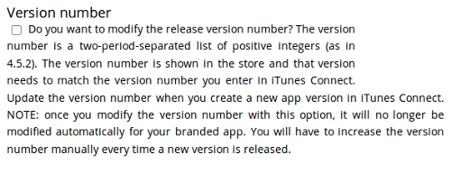

=====================================
Building Your iOS App With ownBrander
=====================================

At long last you have arrived at the point where you can actually build your 
branded iOS app. Log into your account on 
`Customer.owncloud.com/owncloud <https://customer.owncloud.com/owncloud/>`_ and 
open the ownBrander app.

If you don't see the ownBrander app, open a support request (**Open Case** 
button).

Your first ownBrander task is to review the iOS page on ownBrander for your 
image requirements. You will need a lot of them, in specific sizes and formats, 
and they're all listed on the ownBrander page.

There are three sections: Required, Suggested, and Advanced. The Required 
sections contains all of the required elements that you must configure. 
Suggested and Advanced allow additional customizations.

When you have completed and submitted your app, email your three provisioning 
profiles and P12 certificate to branding@owncloud.com.

Required Section
----------------

Enter your application name. This can be anything; in this example it is the 
same name used in our signing certificate examples.

Next, enter your ownCloud server URL. This hard-codes it into your app. If you 
leave this blank then your users will have to enter it every time they use the 
app. 

Check **Server URL Visible** to make your ownCloud server URL the default, and 
to allow your users to enter a different URL.

And now, the all-important **Bundle ID**. Make sure that this is exactly the 
same as the **Bundle ID** you created on 
`Developer.apple.com <developer.apple.com>`_ (see :doc:`publishing_ios_app_3`).

You must also enter the **App Group** you created.

Check **Show multi-account or disconnect** if you plan to allow your users to 
have more than one ownCloud account.

Check **Enable SAML** authentication if that is what you use on your ownCloud 
server. Otherwise leave it blank.

**Number of uploads shown** controls the length of the most recent uploads list 
on the app. The default is 30.

The next section is for uploading your custom artwork to be built into the app. 
The ownBuilder app tells you exactly which images you need, and their required 
size. You only need one Splash Screen image, and ownBrander will automatically 
resize and crop it for different-sized screens. You must also select a 
background color, which ensures that the splash screen image is always at the 
correct size ratio. (Click the example images on the right to enlarge them.)

   
You may enter a custom **User agent**, which is useful for traffic analysis and 
whitelisting your app.
   

Check **Recommend** to open a Twitter, Facebook, and Email recommendation 
configurator.

If you have online help, enter the URL here.

**Activate the option feedback** creates an option for your users to either 
enable or not enable the feedback option on their devices. If you enable this, 
enter your **Feedback email** address.

Enter your **Imprint URL** (your "about" page)

Check **Show a "new account" link in app** to allow new users to request a new 
account.

Upload an icon that will be displayed by default when there is no file preview 
to display.

By default, both internal sharing and sharing by link are enabled. You have the 
options to disable one or both of these. 

You may disable background transfers if you are using mobile device management 
(MDM), such as Mobile Iron, that does not support background jobs, or if you 
simply do not want to allow the app to work in the background. By default, 
the ownCloud iOS app supports background file transfers by taking
advantage of `Background Execution. 
<https://developer.apple.com/library/ios/documentation/iPhone/Conceptual/
iPhoneOSProgrammingGuide/BackgroundExecution/BackgroundExecution.html>`_

.. figure:: images/ownbrander-32.png
   :alt: Option to disable background transfers.

The default version number of your branded app is the same as the official 
ownCloud app. You have the option to customize your version number. Once you do 
this, you will have to update it manually for new releases. This must be the 
same as the version number that you enter in iTunes. Your version number is 
visible to your users.

You may also customize the build number, which defaults to 1.0.0. This 
must also be manually updated when you customize it.  Your build number is used 
by iTunes to uniquely identify your app. When the build number changes, iTunes 
automatically syncs the updates for your users. The build number is not visible 
to your users.

That completes the required elements of your branded iOS app.

Suggested Section
-----------------

The Suggested section allows you to customize additional elements such as text 
and background colors, and icons. The Suggested items are all optional.

Advanced Section
----------------

The Advanced section allows you to optionally customize the color of messages 
such as connection status, error messages, letter separators, buttons, and 
additional icons.

Generate iOS App
----------------

When you have uploaded all of your images and completed your customizations, 
click the **Generate iOS App** button and take a well-deserved break. Remember 
to email your four Ad Hoc provisioning profiles and P12 certificate to 
branding@owncloud.com.

You may go back and make changes, and when you click the **Generate iOS App** 
button the build system will use your latest changes.

Check your account on `Customer.owncloud.com 
<https://customer.owncloud.com/owncloud/>`_ in 48 hours to see your new branded 
ownCloud app.
